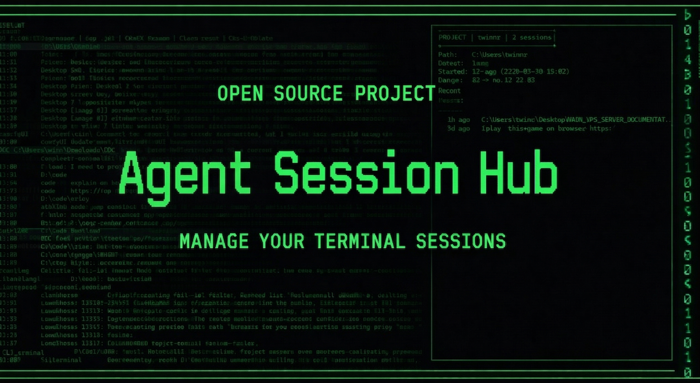

<p align="center">
  
</p>

# Agent Session Hub

Agent Session Hub is a native Rust CLI that gives Codex CLI, Claude Code, and OpenCode a shared, `fzf`-powered session browser.

## Features

- `csx` for Codex sessions
- `clx` for Claude sessions
- `opx` for OpenCode sessions
- `sessionhub` for provider discovery and general help
- One native binary surfaced as `sessionhub`, `csx`, `clx`, and `opx`
- Shared browser model across all supported providers
- Git-aware workspace grouping for repos, branches, and worktrees
- Query filters for `title:`, `repo:`, and `branch:`
- Alias rename and reset
- Codex and OpenCode delete support
- Preview panes and hidden `fzf` helper commands
- Shell integration for bash, zsh, fish, PowerShell, and Windows `cmd`
- Legacy `cxs` alias support

## Requirements

- `fzf` in `PATH`
- At least one supported provider CLI installed:
  - `codex` for `csx`
  - `claude` for `clx`
  - `opencode` for `opx`

If you install from a local checkout, you also need a Rust toolchain.

## Install

macOS / Linux:

```sh
curl -fsSL https://github.com/vinzify/Agent-Session-Hub/releases/latest/download/install.sh | sh
```

Windows PowerShell:

```powershell
irm https://github.com/vinzify/Agent-Session-Hub/releases/latest/download/install.ps1 | iex
```

Those install scripts are shipped as release assets and download the matching release archive for your platform. Local checkouts still build from source.

From a local checkout:

```sh
git clone https://github.com/vinzify/Agent-Session-Hub.git
cd Agent-Session-Hub
./install.sh
```

```powershell
git clone https://github.com/vinzify/Agent-Session-Hub.git
cd Agent-Session-Hub
.\install.ps1
```

The local install path builds the release binary with Cargo, installs `agent-session-hub`, `sessionhub`, `csx`, `clx`, `opx`, and `cxs`, and runs `csx install-shell` unless skipped.

## Usage

```sh
sessionhub
sessionhub providers
sessionhub help
sessionhub opencode browse title:landing
```

`sessionhub` is the generic discovery entrypoint. For daily shell-native resume flows, keep using `csx`, `clx`, or `opx`.

```sh
csx
csx browse repo:Agent-Session-Hub
csx rename <session-id> --name "My alias"
csx reset <session-id>
csx delete <session-id>
csx doctor
```

```sh
clx
clx browse branch:main
clx rename <session-id> --name "Important chat"
clx reset <session-id>
clx doctor
```

```sh
opx
opx browse title:landing
opx rename <session-id> --name "OpenCode task"
opx reset <session-id>
opx delete <session-id>
opx doctor
```

## Shell Integration

The install scripts add shell integration automatically by calling:

```sh
csx install-shell
```

That integration keeps `csx`, `clx`, and `opx` shell-native for resume flows:

- select a session
- change directory in the current shell when possible
- run `codex resume`, `claude --resume`, or `opencode --session`

The legacy alias `cxs` continues to forward to `csx`.

To remove integration:

```sh
csx uninstall-shell
```

## Architecture

The repo now contains only the Rust implementation:

- `src/app.rs`: command dispatch and provider-mode selection
- `src/session.rs`: Codex JSONL, Claude JSONL, and OpenCode SQLite session parsing, display shaping, and query filtering
- `src/browser.rs`: `fzf` row generation, preview output, and browser actions
- `src/config.rs`: alias index persistence and legacy index import
- `src/shell.rs`: shell integration block generation
- `src/provider.rs`: provider metadata and runtime behavior
